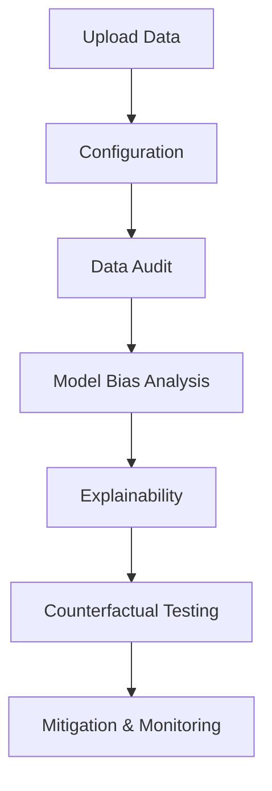

# ⚖️ BIAS-0: The Fairness Guardian for AI

**Audit. Analyze. Mitigate. Monitor.**

BIAS-0 is an end-to-end fairness assurance platform that enables AI engineers to detect, interpret, and mitigate bias in machine learning pipelines.
---
# 🧭 End-to-End Workflow (Visual Walkthrough)

---

## 1️⃣ Data Upload – Secure Ingestion


Upload your dataset (`.csv`) securely into the system.  
BIAS-0 performs an initial scan to validate schema, detect missing values, and prepare data for fairness evaluation.

**Key Capabilities:**
- Secure file ingestion
- Automatic schema detection
- Dataset preview and validation

---

## 2️⃣ Configuration – Define Fairness Context


Configure the fairness evaluation parameters by selecting:

- Sensitive attributes (e.g., gender, caste)
- Target variable (e.g., loan approval)
- Domain context (finance, hiring, etc.)
- Fairness objective (balanced accuracy, equal opportunity)

**Why this matters:**  
Fairness is context-dependent. Proper configuration ensures meaningful bias detection.

---

## 3️⃣ Data Audit – Bias Detection Layer


Analyze dataset-level bias before model evaluation.

**What BIAS-0 detects:**
- Representation imbalance across groups
- Missing or skewed data distributions
- Proxy attributes leaking sensitive information

**Output:**
- Fairness Score (0–100)
- Risk alerts (e.g., *Red Risk Detected*)

---

## 4️⃣ Model Bias Analysis – Metric Evaluation


Evaluate model predictions across demographic groups using standardized fairness metrics.

**Metrics Used:**
- Demographic Parity Difference
- Equal Opportunity Gap
- False Positive Rate (FPR) Gap
- Accuracy per group

**Insight:**  
This stage identifies *which groups are being treated unfairly*.

---

## 5️⃣ Explainability – SHAP-Based Analysis


Understand **why** bias occurs using SHAP-based interpretability.

**Features:**
- Local decision explanations
- Feature contribution breakdown
- High-risk decision flagging

⚠️ Note:  
Explainability does **not guarantee fairness**—it only reveals model behavior.

---

## 6️⃣ Counterfactual Testing – What-If Analysis


Test fairness robustness by simulating changes to sensitive attributes.

**Example:**
- Change gender → Does decision flip?

**Outputs:**
- Flip rate (%)
- Counterfactual fairness score
- Risk classification

**Purpose:**  
Detect hidden discrimination not visible in aggregate metrics.

---

# 📊 Fairness Scoring System


| Score Range | Risk Level | Interpretation |
|------------|-----------|---------------|
| **100** | Perfect | No bias detected |
| **75+** | Low Risk | Minor disparities |
| **50–74** | Moderate Risk | Noticeable bias |
| **<50** | High Risk | Critical bias |

---

# 🏗 Architecture Overview


# ✨ Key Features

- 🔍 Data Bias Detection  
- 🕵️ Proxy Feature Identification  
- ⚖️ Multi-Metric Fairness Evaluation  
- 💡 SHAP Explainability  
- 🔄 Counterfactual Testing  
- 🧪 Sandbox Simulation  
- 📡 Real-Time Monitoring  

---

# 🚀 Quick Start

## 🔧 Backend Setup
```bash
cd backend
python -m venv .venv
source .venv/bin/activate   # Windows: .venv\Scripts\activate
pip install -r requirements.txt
uvicorn main:app --reload

```
## 💻 Frontend Setup
```bash
cd frontend
npm install
npm run dev

```
## 📁 Project Structure

```text
unbiased-ai/
├── backend/
│   ├── core/
│   ├── models/
│   ├── routers/
│   └── main.py
│
├── frontend/
│   ├── src/
│   │   ├── components/
│   │   ├── pages/
│   │   ├── App.tsx
│   │   └── main.tsx
│   │
│   ├── public/
│   ├── index.html
│   └── package.json
│
├── data/
├── assets/
└── README.md
