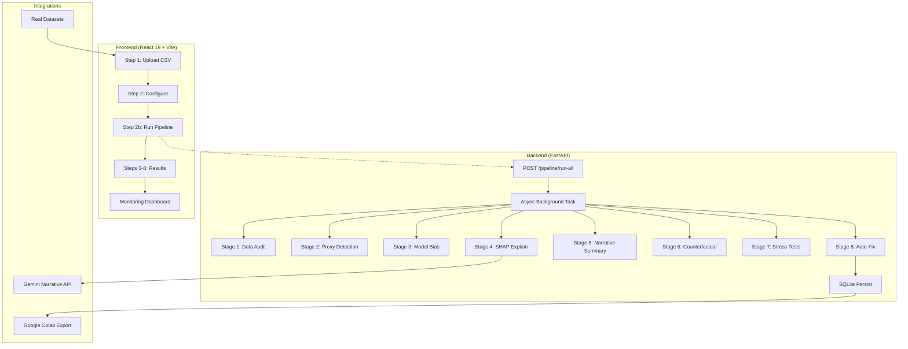
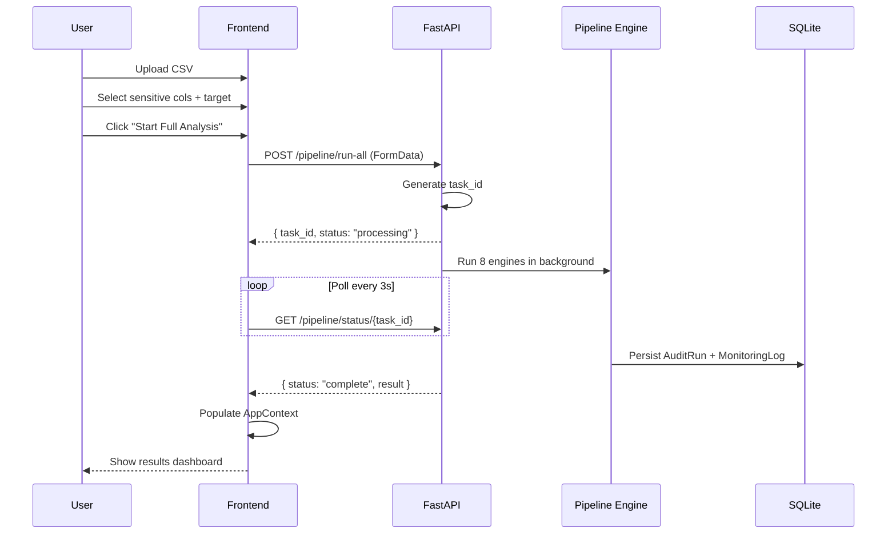

<div align="center">

# ⚖️ BIAS-LAB — Enterprise AI Fairness Platform

**Audit. Explain. Mitigate. Monitor.**

[](https://github.com/Ganesh-0509/Bias-Lab/actions/workflows/ci.yml)
[](LICENSE)
[](https://www.python.org/)
[](https://react.dev/)
[](https://fastapi.tiangolo.com/)
[](backend/tests/)
[](CONTRIBUTING.md)

</div>

---

## Table of Contents

- [Overview](#overview)
- [Architecture](#architecture)
- [Tech Stack](#tech-stack)
- [Features](#features)
- [Quick Start](#quick-start)
- [API Reference](#api-reference)
- [Built-in Datasets](#built-in-datasets)
- [Fairness Scoring](#fairness-scoring)
- [Environment Variables](#environment-variables)
- [Testing](#testing)
- [Docker Deployment](#docker-deployment)
- [Project Structure](#project-structure)
- [Contributing](#contributing)
- [License](#license)

---

## Overview

BIAS-LAB is an end-to-end **fairness assurance platform** for AI/ML pipelines. It enables data scientists and compliance teams to detect, interpret, and mitigate demographic bias through a unified 8-engine analysis pipeline.

Unlike fragmented open-source libraries (IBM AIF360, Fairlearn) that require ML expertise and offer no UI, BIAS-LAB provides a **production-grade full-stack experience** — upload a CSV, configure sensitive attributes, and receive a comprehensive fairness report with actionable fix recommendations.

### Who Is This For?

| Role | What They Get |
|------|---------------|
| **Data Scientists** | Automated fairness metrics, SHAP explainability, proxy detection |
| **Compliance Officers** | Human-readable narrative reports (Gemini-powered), risk scoring |
| **ML Engineers** | API-first design, CI/CD integration, custom model upload |
| **Hackathon Judges** | 38 passing tests, real datasets, live demo ready |

---

## Architecture

### System Overview



### Data Flow



---

## Tech Stack

| Layer | Technology | Purpose |
|-------|-----------|---------|
| **Frontend** | React 18.3, TypeScript 5.7, Vite 6 | UI framework |
| **Routing** | react-router-dom 7.1 | Lazy-loaded client-side routing |
| **State** | React Context (AppContext) | Global state without Redux overhead |
| **Charts** | Recharts 2.15 | Fairness score visualizations |
| **3D** | React Three Fiber + Drei | Interactive hero network graph |
| **Animations** | Framer Motion 12 | Page transitions and micro-interactions |
| **Backend** | Python 3.12+, FastAPI 0.111 | REST API server |
| **ML/Analytics** | scikit-learn, SHAP, fairlearn | 8 analysis engines |
| **Database** | SQLite + SQLAlchemy ORM | Persistent storage |
| **AI** | Google Gemini API | Narrative report generation |
| **Infra** | Docker, GitHub Actions | CI/CD pipeline |

---

## Features

### Core Engine (8-Stage Pipeline)

| # | Stage | Module | What It Does |
|---|-------|--------|-------------|
| 1 | **Data Audit** | `data_audit.py` | Computes class distributions, missing data rates, approval rates per demographic group |
| 2 | **Proxy Detection** | `feature_intelligence.py` | Identifies surrogate attributes using Cramer's V correlation + clustering purity |
| 3 | **Model Bias** | `model_bias.py` | Demographic Parity, Equal Opportunity, TPR/FPR gaps via fairlearn |
| 4 | **SHAP Explainability** | `explainability.py` | Local feature importance for rejected decisions using TreeExplainer |
| 5 | **Narrative Summary** | `explainability.py` | Converts SHAP values into plain-English paragraphs |
| 6 | **Counterfactual** | `counterfactual.py` | Flips sensitive attribute, measures flip rate |
| 7 | **Stress Tests** | `stress_test.py` | Minority under-sampling, label noise, distribution shift |
| 8 | **Auto-Fix** | `auto_fix.py` | Rule-based recommendations (threshold tuning, SMOTE, feature dropping) |

### Platform Capabilities

- **Real Datasets**: UCI Adult Income (48k rows) + COMPAS Recidivism (7k rows) — one-click load
- **Colab Export**: Generate downloadable Jupyter notebooks from any audit run
- **Narrative Reports**: AI-powered executive summaries via Google Gemini API
- **Sandbox Simulation**: Test mitigation strategies before applying them
- **Monitoring**: Simulated post-deployment drift detection with alerting
- **Custom Models**: Upload `.pkl`/`.joblib` files or use built-in Random Forest

---

## Quick Start

### Prerequisites

- Python 3.12+
- Node.js 20+
- npm or yarn

### 1. Clone and Install Backend

```bash
git clone https://github.com/Ganesh-0509/Bias-Lab.git
cd Bias-Lab/backend
python -m venv .venv
source .venv/bin/activate          # Linux/Mac
# .venv\Scripts\activate           # Windows
pip install -r requirements.txt
python data_prep.py                 # Download built-in datasets
python -m uvicorn main:app --reload
```

### 2. Install and Run Frontend

```bash
cd Bias-Lab/frontend
npm install
npm run dev                         # Opens http://localhost:5173
```

### 3. Run Your First Audit

1. Open `http://localhost:5173` in your browser
2. Click **New Project** in the top menu, give it a name and domain
3. On Step 1, click **UCI Adult Income** or **COMPAS Recidivism** to load a real dataset instantly
4. On Step 2, columns and sensitive attributes are pre-configured — adjust as needed
5. Click **Start Full Analysis**
6. View results across Steps 3–8

---

## API Reference

### Pipeline

| Method | Path | Description |
|--------|------|-------------|
| `POST` | `/api/pipeline/run-all` | Start unified fairness analysis (FormData: file + config) |
| `GET` | `/api/pipeline/status/{task_id}` | Poll for completion status |
| `GET` | `/api/pipeline/result/{task_id}` | Fetch persistent result |

### Datasets

| Method | Path | Description |
|--------|------|-------------|
| `GET` | `/api/datasets` | List all available built-in datasets |
| `GET` | `/api/datasets/download/{name}` | Download dataset CSV |
| `POST` | `/api/datasets/load/{name}` | Load dataset metadata + preview |

### Reports & Analysis

| Method | Path | Description |
|--------|------|-------------|
| `POST` | `/api/colab/export` | Generate Jupyter notebook (.ipynb) from results |
| `POST` | `/api/narrative/generate` | Generate Gemini-powered executive summary |
| `POST` | `/api/fixes/recommend` | Get auto-fix recommendations |
| `POST` | `/api/fixes/sandbox` | Simulate fix strategies |

### Monitoring

| Method | Path | Description |
|--------|------|-------------|
| `POST` | `/api/monitoring/{project_id}/simulate` | Simulate post-deployment monitoring event |
| `GET` | `/api/monitoring/{project_id}` | Get monitoring history |

### Health

| Method | Path | Description |
|--------|------|-------------|
| `GET` | `/health` | Server health check |

---

## Built-in Datasets

| Dataset | Source | Rows | Columns | Target | Sensitive | Domain |
|---------|--------|------|---------|--------|-----------|--------|
| **UCI Adult Income** | UCI ML Repository | 48,842 | 15 | `income` | `race`, `sex` | Finance |
| **COMPAS Recidivism** | ProPublica | 7,214 | 6 | `two_year_recid` | `race`, `sex` | Criminal Justice |

Datasets are downloaded via `python backend/data_prep.py` and loaded through the UI on Step 1.

---

## Fairness Scoring

| Score Range | Risk Level | Interpretation |
|------------|-----------|---------------|
| **75 – 100** | 🟢 Low Risk | Minor disparities, likely acceptable |
| **50 – 74** | 🟡 Moderate Risk | Noticeable bias requiring attention |
| **0 – 49** | 🔴 High Risk | Critical bias detected, immediate action needed |

### Composite Score Formula

```
Unified Score = 0.25 × Model Bias + 0.20 × Counterfactual
              + 0.20 × Stress Test + 0.20 × Data Audit
              + 0.15 × Proxy Risk
```

---

## Environment Variables

| Variable | Required | Default | Description |
|----------|----------|---------|-------------|
| `GEMINI_API_KEY` | No | — | Google Gemini API key for narrative reports |
| `VITE_GA_MEASUREMENT_ID` | No | — | Google Analytics 4 Measurement ID |
| `CORS_ALLOW_ALL` | No | `0` | Set to `1` for development with wildcard CORS |

Copy `frontend/.env.example` to `frontend/.env` and configure as needed.

---

## Testing

### Backend (38 tests)

```bash
cd backend
python -m pytest tests/ -v           # Run all tests
python -m pytest tests/test_core.py -v  # Core engine tests
python -m pytest tests/test_new_modules.py -v  # New module tests
```

Tests cover all 8 ML engines, dataset loading, Colab export, and Gemini prompt builder.

### Frontend

```bash
cd frontend
npx tsc --noEmit                     # TypeScript check
npm run build                        # Production build
```

---

## Docker Deployment

```bash
# Build and run with Docker Compose
docker-compose up --build

# Or build individually
docker build -t bias-lab-backend -f backend/Dockerfile .
docker run -p 8000:8000 bias-lab-backend
```

A `Dockerfile` is included for containerized deployment to Render, Railway, or Google Cloud Run.

---

## Project Structure

```
bias-lab/
├── backend/                          # FastAPI backend
│   ├── core/                         # 8 ML analysis engines
│   │   ├── data_audit.py             # Stage 1: Demographic audit
│   │   ├── feature_intelligence.py   # Stage 2: Proxy detection
│   │   ├── model_bias.py             # Stage 3: Fairness metrics
│   │   ├── explainability.py         # Stage 4-5: SHAP + narrative
│   │   ├── counterfactual.py         # Stage 6: Flip tests
│   │   ├── stress_test.py            # Stage 7: Stress scenarios
│   │   ├── auto_fix.py               # Stage 8: Recommendations
│   │   ├── monitoring.py             # Drift detection
│   │   ├── sandbox.py                # Fix simulation
│   │   ├── dataset_loader.py         # Built-in dataset loader
│   │   └── common.py                 # Shared ML utilities
│   ├── models/                       # SQLAlchemy ORM
│   │   └── db.py                     # Project, AuditRun, MonitoringLog, Alert
│   ├── routers/                      # FastAPI endpoint definitions
│   │   ├── pipeline.py               # Unified /pipeline/ endpoints
│   │   ├── datasets.py               # Built-in dataset API
│   │   ├── colab.py                  # Colab notebook export
│   │   ├── gemini_narrative.py       # Gemini-powered reports
│   │   ├── fixes.py                  # Fix recommendations
│   │   ├── sandbox.py                # Sandbox simulation
│   │   ├── monitoring.py             # Monitoring & alerts
│   │   ├── project.py                # Project CRUD
│   │   ├── audit.py                  # Legacy audit endpoints
│   │   └── bias.py                   # Legacy bias endpoints
│   ├── utils/                        # Helpers
│   │   ├── data_io.py                # CSV/file parsing
│   │   └── model_loader.py           # .pkl/.joblib loader
│   ├── tests/                        # Test suite (38 tests)
│   │   ├── test_core.py              # Core engine tests (30)
│   │   └── test_new_modules.py       # New module tests (8)
│   ├── main.py                       # App entry point
│   ├── data_prep.py                  # Dataset download script
│   └── requirements.txt
├── frontend/                         # React + TypeScript frontend
│   ├── src/
│   │   ├── components/               # Reusable React components
│   │   │   ├── animatations/         # Loading animations
│   │   │   ├── hero/                 # 3D Three.js hero section
│   │   │   ├── ui/                   # UI primitives
│   │   │   └── ErrorBoundary.tsx     # Production error boundary
│   │   ├── pages/workflow/           # 8-step wizard
│   │   ├── context/AppContext.tsx    # Global state management
│   │   ├── api/client.ts            # Axios HTTP client
│   │   └── types/                   # TypeScript type definitions
│   ├── public/                       # Static assets
│   │   ├── robots.txt                # SEO
│   │   ├── sitemap.xml               # XML sitemap
│   │   ├── llms.txt                  # LLM discovery file
│   │   ├── og-image.png              # Open Graph (1200×630)
│   │   ├── twitter-image.png         # Twitter Card (800×418)
│   │   └── favicon*.png              # Favicon set (16px–512px)
│   ├── index.html                    # OG tags, Schema.org JSON-LD, GA4
│   └── .env.example                  # Environment template
├── data/                             # Gitignored — datasets live here
├── .github/workflows/ci.yml          # CI pipeline (lint + test + build)
├── Dockerfile                        # Containerized deployment
├── LICENSE                           # MIT License
└── README.md                         # This file
```

---

## Contributing

Contributions are welcome. Please ensure:

1. All existing tests pass (`python -m pytest tests/ -v` in `backend/`)
2. TypeScript compiles cleanly (`npx tsc --noEmit` in `frontend/`)
3. The build succeeds (`npm run build` in `frontend/`)
4. New features include corresponding test coverage

---

## License

MIT — see [LICENSE](LICENSE)

---

<div align="center">
  <sub>Built for the Google AI Hackathon 2026</sub>
</div>
